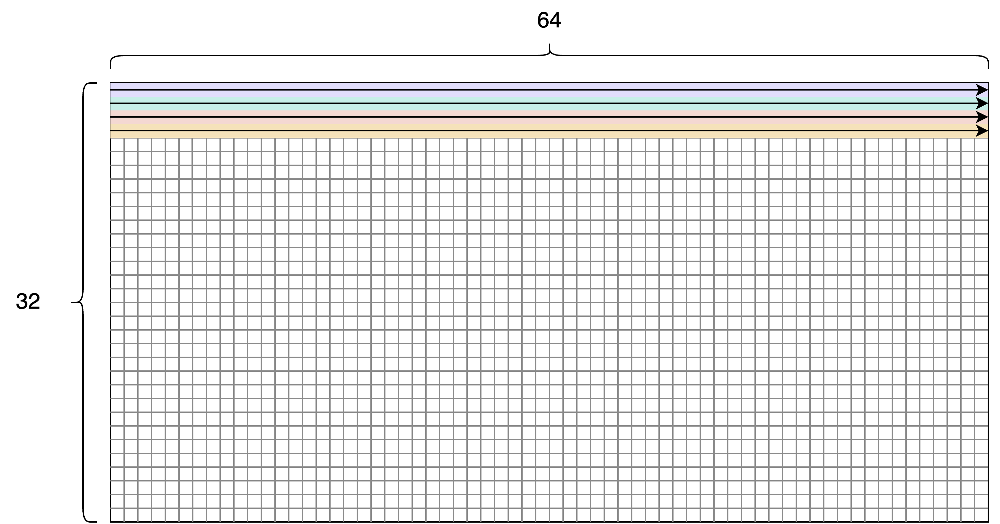
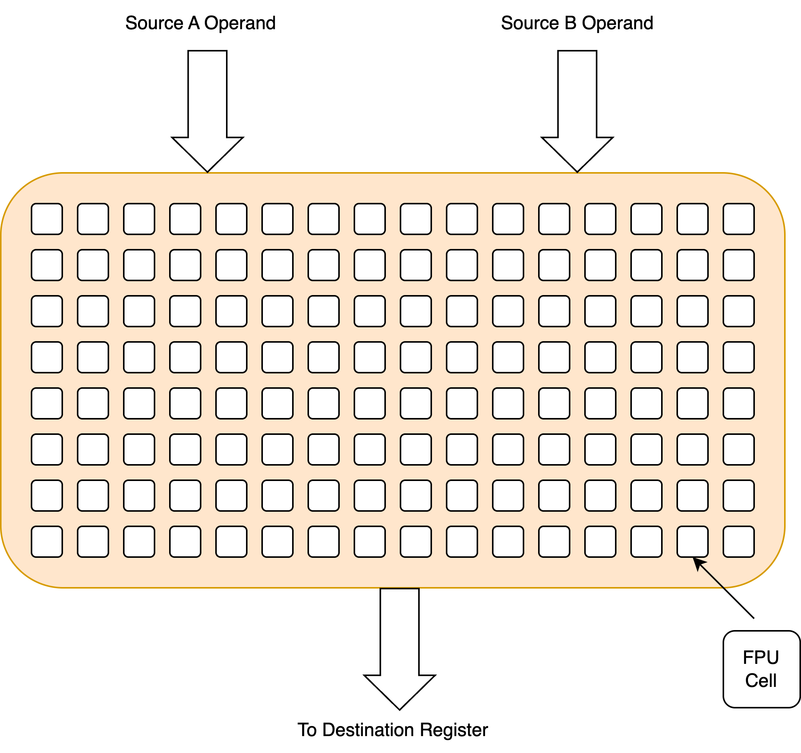

# Getting started with Tensix Core and Low-level Kernels

## Introduction

Low-Level Kernels (LLKs) form the foundational layer in the Tenstorrent software stack. LLKs directly drive hardware to perform matrix and vector operations that are fundamental to machine learning computations. This document provides an overview of Tensix Core functions.

## Tensix Core

Tenstorrent chips are architected as a matrix of Tensix Cores. Figure 1 shows the top-level diagram of a Tensix Core:

   
  <em>Figure 1: Top-level diagram of Tensix Core</em>

Figure 1 consists of four major parts:

1. Internal SRAM (L1) Memory - Stores input/output tensors and program code for all RISC-V processors within the core.
2. Network-On-Chip (NoC) - Manages data movement between Tensix Cores and DRAM across the chip.
3. 5 RISC-V Processors -
   * NCRISC and BRISC - Communicate with the NOC for board setup.
   * TRISCs - Responsible for controlling the Tensix Engine by issuing custom Tensix instructions.
4. Tensix Engine - Hardware block controlled by the TRISC processors, responsible for efficient matrix calculations (essential part of AI/ML operations).

The main tasks that LLKs perform rely on transferring data to and from L1 memory, and programming Tensix engine to perform different operations on the data that is stored in it.

## Tensix Engine

The Tensix Engine is a multi-threaded, single-issue, in-order processor with a custom instruction set (Tensix ISA). It has three threads, controlled from three different instruction streams, one from each TRISC.

Figure 2 represents a simplified top-level architecture of the Tensix Engine:

   
  <em>Figure 2: Top-level architecture of Tensix Engine</em>

Figure 3 shows circular data flow. Inputs arrive in L1 and are unpacked into source registers for processing by the FPU. After the FPU processes the data, it is written into the destination register, then written into L1 (packing).

   
  <em>Figure 3: Data flow inside Tensix Core</em>

## Inputs

When talking about the input, each element of the tensor is referred to as *datum*. Figure 4 represents an example of a 32x64 input tensor, where each square represents a single datum.

   
  <em>Figure 4: "An example of 32x64 input tensor"</em>

There are two ways to store the input tensors in the L1 memory:

1. Row-major order;
2. Tile order.

Row-major order is the “natural” order of storing data; it is stored row by row regardless of size.

   
  <em>Figure 5: Row-major order of input data</em>

However, for LLKs to work efficiently, the input data must be divided into tiles of 32x32 data values. The tile order requires the data to be further divided into four faces, with each face being 16x16 data values. The data is stored row by row for each face, from F0 to F3. LLKs ensure that data is properly transformed into the tile order before performing calculations.

   
  <em>Figure 6: Tile order of input data</em>

## Data formats

Input and output tensors can be stored using different formats, allowing the programmer to choose the smallest precision that fits their application. For the full list of available formats, please refer to [the official data format table](https://docs.tenstorrent.com/pybuda/latest/dataformats.html). Note that not all parts of the Tensix Core support all of the available data formats. However, all the data formats can be stored in the L1 memory. When being unpacked, only a subset of the formats are available.

Another important concept is [math fidelity](https://docs.tenstorrent.com/pybuda/latest/dataformats.html). Depending on the data format, it can take multiple phases of multiplication to achieve full accuracy of the result. Therefore, programmers can choose how many fidelity phases are enough for their specific application. Tensix Cores provide up to four fidelity phases for all data formats.

## Unpacker

The Unpacker is a DMA engine, used to move data between L1 memory and source operand registers. Tensix architectures feature two unpackers, one for each operand in the operation. Unpacker 0 is connected to Source A register, while unpacker 1 is connected to Source B register. Additionally, Unpacker 0 is able to unpack the data directly into the Destination register.

   
  <em>Figure 7: Unpackers</em>

Unpackers contain hardware support for data format adjustments, called gaskets, enabling data type conversion without software overhead.
A designated set of instructions for controlling the unpackers is issued by TRISC0.

## Source Operand Register files (Source A and Source B)

Source registers are organized as two-dimensional structures. Each source register is designed to hold one tile. Source registers store the data produced by the unpackers. In order to achieve high-throughput and retain the pipelined execution, source registers are double-buffered.

## Floating Point Unit (FPU)

Floating Point Unit is the main math engine used to perform most operations inside the Tensix Core.

   
  <em>Figure 8: Floating Point Unit</em>

The FPU takes operands from Source A and Source B operands, and writes the result of the operation inside the Destination register. It is organized as a matrix of FPU cells \- multifunctional units consisting of multipliers and adders, accompanied by accumulators in Destination register.
Each FPU cell can perform three functions:

1. Accumulated dot product;
2. Accumulated element-wise addition;
3. Element-wise addition;

The FPU, like all the other parts of the Tensix Engine, has a designated set of Tensix instructions. The instructions are issued by the TRISC1.

## Special FPU (SFPU)

In cases where the programmer needs special operations that FPU cannot perform, they can opt to use SFPU. It can be thought of as a SIMD engine, meaning that it performs the same operation on multiple data points simultaneously. Compute SFPU can be used to perform 32-bit input calculations and enables implementing complex functions, such as sigmoid, exponential, reciprocal etc.
SFPU requires operands to be stored inside the Destination register. That means that, before the SFPU starts executing the instructions, the data needs to be copied from Source A/B to the Destination register through FPU, or directly unpacked to Destination register from L1 memory using Unpacker 0. The results produced within SFPU calculations are also stored in the Destination register.
SFPU is instantiated within FPU, meaning that the same processors used for issuing FPU instructions (TRISC1) should be in charge of issuing SFPU instructions.

## Packer

The Packer is a DMA engine that transfers data from the Destination register to L1 memory. Like the Unpackers, it implements hardware-accelerated data conversion through gaskets. TRISC2 controls the Packer through its dedicated instruction set.

## Low Level Kernel Operations

LLK operations encapsulate the utilization of the previously described hardware blocks. These operations are categorized by their resource usage into three groups:

1. Unpack operations - Data movement from L1 to source registers
2. Math operations - Computational tasks using FPU/SFPU
3. Pack operations - Data movement from destination register to L1

### LLK Unpack Operations (Table 1)

Table 1 contains all unpack operations currently implemented for Tensix:

| LLK Header | Description |
|:-----------|:------------|
| `llk_unpack_A.h` | Unpacks a single tile from L1 into Source A register. Used for unary operations. |
| `llk_unpack_AB.h` | Unpacks two tiles from L1 into Source A and Source B registers. Used for binary operations. |
| `llk_unpack_AB_matmul.h` | Optimizes matrix multiplication by unpacking tiles into Source A and B with register reuse. |
| `llk_unpack_reduce.h` | Unpacks a single tile into Source A and a scalar value into Source B for reduction operations. |
| `llk_unpack_tilize.h` | Converts row-major input data into tile format during unpacking. |
| `llk_unpack_untilize.h` | Converts tiled data back to row-major format during unpacking. |
---

### LLK Math Operations (Table 2)

Table 2 contains all math operations currently implemented for Tensix:

| LLK Header | Description |
|:-----------|:------------|
| `llk_math_eltwise_unary_datacopy.h` | Transfers a tile from Source A/B to Destination register using FPU. |
| `llk_math_eltwise_unary_sfpu.h` | Executes unary operations on a tile data in the Destination register using SFPU. |
| `llk_math_eltwise_binary.h` | Performs element-wise operations (add/sub/mul) on Source A and B tiles using FPU, storing results in Destination register. |
| `llk_math_eltwise_reduce.h` | Computes global maximum or average from Source A using scalar values from Source B via FPU. |
| `llk_math_eltwise_matmul.h` | Performs matrix multiplication between Source A and Source B tiles using FPU. |
---

### LLK Pack Operations (Table 3)

Table 3 contains all pack operations currently implemented for Tensix:

| LLK Header | Description |
|:-----------|:------------|
| `llk_pack.h` | Transfers a tile from Destination register to L1 memory, maintaining tile format. |
| `llk_pack_untilize.h` | Transfers a tile from Destination register to L1 memory, converting to row-major format. |
---
